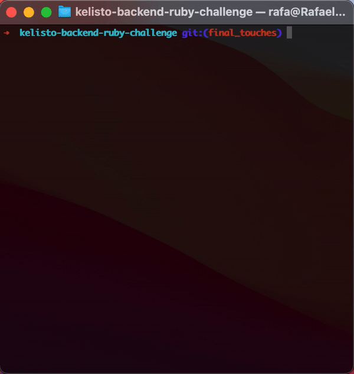
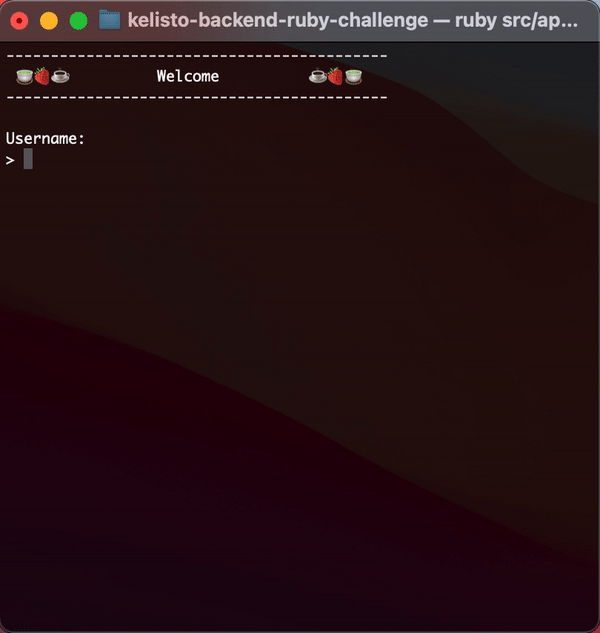
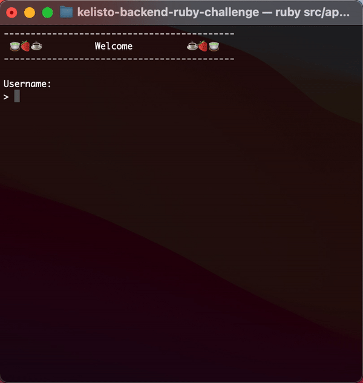
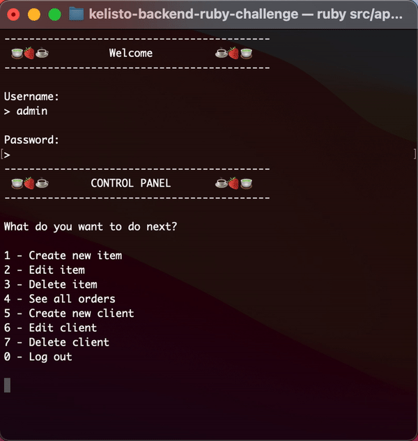

## ✨  Introduction

For this challenge I used OOP for the development of the entire app. I worked on a series of interfaces to guide the user to use the platform properly. In this case opening **app.rb** from the Terminal can trigger the star of the app.



#### 🚀Usage

There are two types of users for this app.

- Client

```js
username: client
password: password
```

The client can scan food that is available and can check thier previous Checkout Carts.



(Gif client)

- Admin

```js
username: admin
password: password
```

The admin can create/edit/delete items and users.





It also have the prvilege to see all the Checkout Carts available, no matter the user.


## 🥵 Challenge

For this particular projects, I think the most challenging think was having a global vision of the goal of it. I wanted to give more in terms of code and usability and I think at first was a little confusing, but I am happy with the resoult.

I also tried to implement test using **rake**, but I think i would do it better if I had more time.

## 🤘 Improvements

I would implement a proper class for the Offers, making it available for the admin to create it, edit it and delete it. I also would clean a litte bit more the code.
